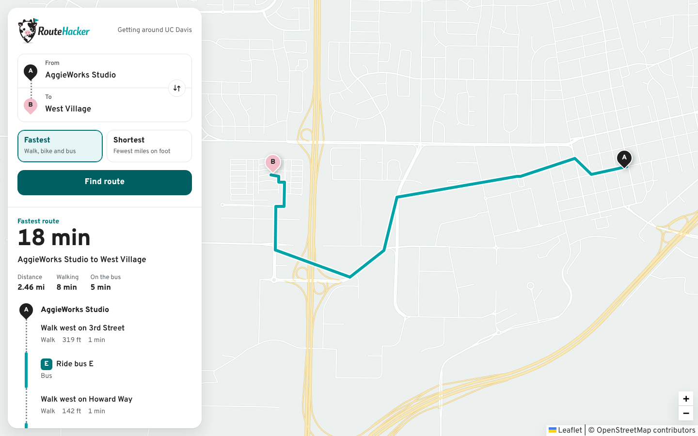
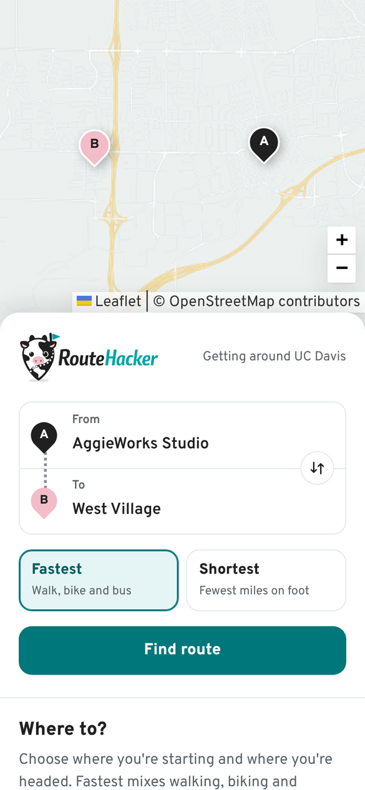
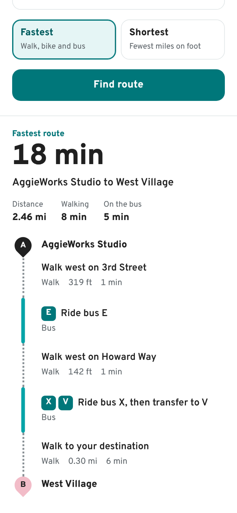
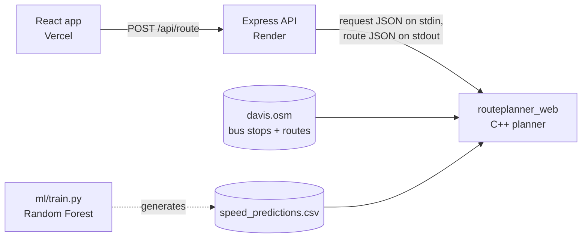

<p align="center">
  
</p>

<p align="center">
  <strong>Walking, biking and bus directions around UC Davis, computed by a C++ routing engine on real OpenStreetMap and bus data.</strong>
</p>

<p align="center">
  <a href="https://routehacker.vercel.app"><strong>Try it live</strong></a> ·
  <a href="#how-it-works">How it works</a> ·
  <a href="#run-it-locally">Run it locally</a> ·
  <a href="ml/README.md">Speed-limit model</a>
</p>



<p align="center">
  
  &nbsp;
  
</p>

## What it does

Pick where you're starting and where you're headed, choose **Fastest** or **Shortest**, and RouteHacker plans the trip:

- **Fastest** searches walking, biking and the campus bus network by travel time, including transfers between bus lines.
- **Shortest** finds the shortest path on foot.
- The result shows total time and distance, how long you'll spend walking, biking or on the bus, and step-by-step directions drawn as a **strip map**: dotted legs for walking, dashed for biking, solid teal for buses with their route letters (`E`, `X → V`).
- The route is drawn on a full-screen map with start and destination pins.

Every request runs the real planner. There's no precomputed or mocked routing.

## Highlights

| | |
| --- | --- |
| **C++ routing engine** | Dijkstra over a multimodal graph built from 1,644 OpenStreetMap roads, 297 bus stops and 17 bus routes. Originally the ECS 34 transportation planner, now served over HTTP. |
| **100× faster** | Routes used to take ~15 s. Profiling found 90% of the time in the XML reader, which rescanned the whole 1.2 MB map for every self-closing tag (quadratic). It now uses expat's empty-element signal instead: **~0.14 s per route**, identical output. |
| **ML speed limits** | Only 145 of 1,644 roads have a posted speed limit. A scikit-learn Random Forest predicts the rest (**96.6% held-out accuracy**), and the planner uses those predictions when it estimates bus travel times. [Details](#speed-limit-model) |
| **Product UI** | React + Leaflet, keyboard-navigable place search, plain-language directions and errors, responsive down to phone width, reduced-motion support. |
| **Tested** | 63 C++ (GoogleTest), 8 API and 9 frontend tests. |

## How it works



1. The React app sends `start`, `end` and `optimization` to `POST /api/route`.
2. The Express API ([routeRouter.js](server/src/routes/routeRouter.js), [routeService.js](server/src/services/routeService.js)) validates the request and caches recent results.
3. [cppPlannerService.js](server/src/services/cppPlannerService.js) runs the compiled planner, [routeplanner_web.cpp](src/routeplanner_web.cpp), with the request as JSON on stdin, and enforces a timeout.
4. The planner loads the street map, the bus system and the predicted speed limits, finds the nearest map nodes, and runs Dijkstra ([DijkstraTransportationPlanner.cpp](src/DijkstraTransportationPlanner.cpp)) for the fastest or shortest path.
5. The API turns the planner's output into clean steps, a walk/bike/bus breakdown and map geometry, which the frontend draws as the strip map and the route line.

## Speed-limit model

Road speeds set how long bus legs take, so missing speed limits make fastest-route times less accurate. Before this model, every untagged road was assumed to be 25 mph.

- **Features:** road type, lanes, one-way, name and name suffix (Street, Boulevard, ...), route reference, bridge/layer, surface, cycleway/bicycle/truck/access tags, roundabout, traffic calming, segment length and location. Tags that encode a speed directly (`maxspeed:hgv`, `maxspeed:trailer`, ...) are excluded to avoid label leakage.
- **Class imbalance:** the first model over-predicted 25 mph (44 predictions vs 38 true) and could never predict 15 or 55 mph, which have one example each. The training script reports the class distribution, drops classes with fewer than 5 examples, and retrains with balanced class weights, so the model never outputs a speed it has no support for.
- **Results:**

  | Evaluation | Accuracy |
  | --- | --- |
  | Stratified 80/20 held-out test | **96.6%** |
  | Repeated stratified 5-fold CV (×10) | **97.2% ± 2.3%** |

- **Integration:** [PredictedSpeedStreetMap.h](include/PredictedSpeedStreetMap.h) exposes each prediction to the planner as `maxspeed:predicted`. Speed is resolved as posted `maxspeed` → predicted speed → 25 mph default. Run `bin/routeplanner_web --no-predicted-speeds` to compare against the old behavior.

The full training report, including the diagnosis output, is in [ml/README.md](ml/README.md).

## Run it locally

**Requirements:** Node.js 20+, a C++20 compiler, `make`, `pkg-config` and the expat headers: `libexpat1-dev` on Debian/Ubuntu, or on macOS `brew install expat pkg-config` followed by `export PKG_CONFIG_PATH="$(brew --prefix expat)/lib/pkgconfig"`. The [dev container](.devcontainer/devcontainer.json) has everything preinstalled.

```bash
git clone https://github.com/prithika5/routehacker.git
cd routehacker
npm install                          # also compiles bin/routeplanner_web
cp client/.env.example client/.env   # points the app at http://localhost:3000
npm run dev
```

Open http://localhost:5173. The API runs on http://localhost:3000.

If the planner didn't compile during install (for example, expat was missing), install the requirements and run `npm run build:planner`.

### Retrain the speed-limit model (optional)

```bash
pip install -r ml/requirements.txt
python3 ml/train.py   # prints the evaluation and rewrites data/speed_predictions.csv
```

## Tests

```bash
npm test              # API (Vitest + Supertest) and frontend (Vitest + Testing Library)
make                  # builds and runs every C++ GoogleTest suite (then a coverage report, which needs gcovr)
make run_tptest       # just the planner tests, including the predicted-speed fallback
npm run build         # production build of the frontend
```

The API tests run against the JavaScript demo engine so they're fast and deterministic. The C++ planner is covered by its own GoogleTest suites, and the server logs a live planner check every time it starts.

## Deployment

- **Frontend:** Vercel builds `client/`. Set `VITE_API_BASE_URL` to the API's URL.
- **API:** Render runs a Node web service rooted at `server/` ([render.yaml](render.yaml)). Its build command, `npm install`, also compiles the C++ planner through the server's `postinstall` script ([build-planner.mjs](server/scripts/build-planner.mjs)). On startup the server routes one sample trip and logs `C++ planner ready: …` or the reason it's unavailable.
- **Container (optional):** the [Dockerfile](Dockerfile) compiles the planner in a build stage and ships only the server, the binary and the data.

  ```bash
  docker build -t routehacker-api .
  docker run -p 3000:3000 routehacker-api
  ```

| Environment variable | Where | Purpose |
| --- | --- | --- |
| `VITE_API_BASE_URL` | frontend | URL of the API |
| `CLIENT_ORIGIN` | API | Comma-separated origins allowed to call the API (all origins if unset) |
| `ROUTE_ENGINE` | API | `cpp` (default) requires the C++ planner, `demo` uses the JavaScript demo graph, `auto` falls back to the demo graph if the planner is missing |
| `CPP_PLANNER_TIMEOUT_MS` | API | Planner timeout, default `30000` |
| `CPP_PLANNER_BINARY`, `CPP_PLANNER_DATA` | API | Override the planner binary and data paths |

## API

`POST /api/route`

```json
{
  "start": "aggie_works",
  "end": "west_village",
  "optimization": "fastest",
  "modePreference": "any"
}
```

Locations: `aggie_works`, `memorial_union`, `shields_library`, `silo_terminal`, `arc`, `mondavi_center`, `west_village`, `research_park` (defined in [shared/routeOptions.js](shared/routeOptions.js)). `optimization` is `fastest` or `shortest`.

The response includes `totals` (time and distance), `steps` (mode, instruction, distance, time), a per-mode `breakdown`, GeoJSON `geometry`, and `engine: "cpp"`. Errors come back as `{ "error": { "code", "message" } }`, for example `SAME_LOCATION`, `CPP_PLANNER_TIMEOUT` or `CPP_PLANNER_MISSING`.

`GET /api/health` returns `{ "status": "ok" }`.

## Project structure

```text
client/      React + Vite frontend (map, trip form, strip-map directions)
server/      Express API and the bridge to the C++ planner
shared/      Location and mode definitions used by both
src/         C++ planner: OSM/XML parsing, bus system, Dijkstra, web adapter
include/     C++ headers, including the predicted-speed street map
testsrc/     GoogleTest suites for the C++ code
ml/          Speed-limit model: features, training, evaluation report
data/        davis.osm, bus stops and routes, predicted speed limits
docs/        C++ class docs and screenshots
```

## Background

RouteHacker started as the transportation planner from UC Davis ECS 34 (Project 4): a command-line C++ program for routing over OpenStreetMap and bus data. The original CLI ([transplanner.cpp](src/transplanner.cpp)) and its tests are still here. RouteHacker wraps that engine in a web app, makes it fast enough to serve live requests, and adds the speed-limit model.
