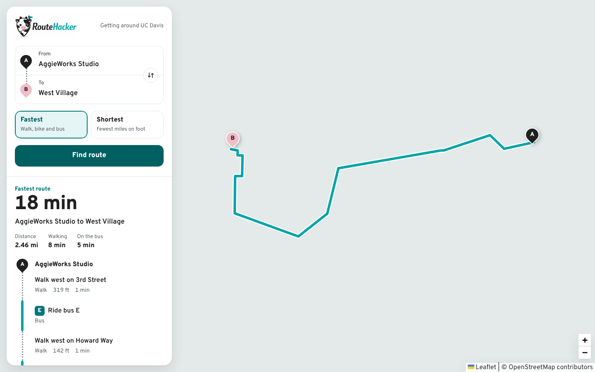

# RouteHacker

RouteHacker is a full-stack transportation planner for UC Davis. It wraps the original ECS 34 C++ routing project in a React frontend and Express API so users can request routes on a real map instead of through a CLI.

Every route request runs the real OpenStreetMap-based C++ planner, which answers in about a tenth of a second. Results show the trip time, a walking/bus breakdown, and directions drawn as a strip map: dotted legs for walking, solid teal legs for buses with their route letters.

## Live Demo

- Frontend: `https://routehacker.vercel.app`
- Backend API: `https://routehacker-api.onrender.com`

## Screenshots

<p>
  
  
</p>

## Highlights

- React + Vite frontend in `client/`
- Express backend in `server/`
- Real C++ transportation planner from the ECS 34 codebase
- OpenStreetMap + bus-system data from `data/`
- Full-screen Leaflet map with a streamlined route planning UI
- Fastest vs. shortest routing
- Searchable Davis start and destination inputs
- Route normalization layer for cleaner C++ planner output
- Random Forest speed-limit model that fills in missing OSM `maxspeed` tags for route-time estimation (see [ml/README.md](ml/README.md))
- Frontend and backend tests
- Dev container support for both C++ and web development

## Architecture

### Request Flow

1. The React app submits `start`, `end`, `optimization`, and `modePreference` to `POST /api/route`.
2. Express validates the request in [server/src/routes/routeRouter.js](server/src/routes/routeRouter.js).
3. The route service in [server/src/services/routeService.js](server/src/services/routeService.js) selects the routing engine.
4. The C++ adapter in [src/routeplanner_web.cpp](src/routeplanner_web.cpp) loads `davis.osm`, `stops.csv`, `routes.csv`, and the ML-predicted speed limits in `speed_predictions.csv`, computes a route, and returns JSON.
5. The backend normalizes the response in [server/src/services/cppPlannerService.js](server/src/services/cppPlannerService.js) so the UI receives cleaner steps, breakdowns, and summaries.
6. The frontend renders the route geometry, summary metrics, and directions.

## Current Engine Behavior

The app is currently configured to prefer the real C++ planner path.

- Default mode: `cpp`
- Successful C++ responses return `engine: "cpp"`
- If the C++ planner cannot complete, the API returns an error instead of silently switching engines
- The C++ adapter currently supports `modePreference: "any"` only

That means the strongest demo path is:

```json
{
  "start": "aggie_works",
  "end": "west_village",
  "optimization": "fastest",
  "modePreference": "any"
}
```

### Performance

A route request takes about 0.14 seconds end to end. It used to take about 15 seconds: profiling showed 90% of the time in the XML reader, which rescanned the whole 1.2 MB map file for every self-closing tag. The reader now uses expat's own empty-element signal instead, with identical output. The backend still has a timeout guard (`CPP_PLANNER_TIMEOUT_MS`, default 30 s) so a stalled planner call fails clearly instead of hanging.

## Speed-Limit Prediction

Only 145 of the 1,644 roads in `davis.osm` have a posted speed limit (`maxspeed` tag). Previously, every other road was assumed to be 25 mph. RouteHacker trains a scikit-learn Random Forest on OpenStreetMap road features to predict the missing speed limits. The C++ planner uses those predictions as a fallback when it estimates route times.

- **Features:** road type, lanes, oneway, name and name suffix, route reference, bridge/layer, surface, cycleway/bicycle/truck/access tags, roundabout, traffic calming, segment length, and location. Tags that encode a speed directly (`maxspeed:hgv`, `maxspeed:trailer`, ...) are excluded to avoid label leakage.
- **Class imbalance:** an early model over-predicted 25 mph (44 predictions vs 38 true) and could never predict the 15 and 55 mph classes, which have one example each. The training script reports the class distribution, drops classes with fewer than 5 examples, and retrains with balanced class weights, so the model never outputs a speed it has no support for.
- **Results:**

| Evaluation | Accuracy |
| --- | --- |
| Stratified 80/20 held-out test | **96.6%** |
| Repeated stratified 5-fold CV (x10) | **97.2% ± 2.3%** |

- **Integration:** [include/PredictedSpeedStreetMap.h](include/PredictedSpeedStreetMap.h) exposes each prediction as a `maxspeed:predicted` attribute. The planner resolves speed as real `maxspeed` tag → predicted speed → 25 mph default, and road speed sets bus travel time in fastest-route search. Pass `--no-predicted-speeds` to `bin/routeplanner_web` to compare against the old behavior.

Retrain and regenerate `data/speed_predictions.csv`:

```bash
pip install -r ml/requirements.txt
python3 ml/train.py
```

See [ml/README.md](ml/README.md) for the full training report.

## Key Files

- [src/routeplanner_web.cpp](src/routeplanner_web.cpp): non-interactive C++ adapter for web requests
- [src/transplanner.cpp](src/transplanner.cpp): original CLI entry point
- [src/DijkstraTransportationPlanner.cpp](src/DijkstraTransportationPlanner.cpp): core ECS 34 routing logic
- [server/src/services/cppPlannerService.js](server/src/services/cppPlannerService.js): Node subprocess bridge and response normalization for the C++ planner
- [ml/train.py](ml/train.py): speed-limit model training, imbalance diagnosis, and prediction export
- [include/PredictedSpeedStreetMap.h](include/PredictedSpeedStreetMap.h): applies predicted speed limits to roads with no `maxspeed` tag
- [server/src/services/routeService.js](server/src/services/routeService.js): engine selection and request caching
- [server/src/services/legacyRouteService.js](server/src/services/legacyRouteService.js): seeded JS fallback engine kept for explicit demo/testing use
- [shared/routeOptions.js](shared/routeOptions.js): shared UI metadata and location coordinates

## Local Setup

### Dev Container

Open the repository in the provided dev container at [.devcontainer/devcontainer.json](.devcontainer/devcontainer.json). It includes both the C++ toolchain and the Node-based web stack.

### Install Dependencies

From the repo root:

```bash
npm install
```

### Set Environment Variables

Create `client/.env` from `client/.env.example` and set:

```bash
VITE_API_BASE_URL=http://localhost:3000
```

### Build the C++ Web Adapter

From the repo root:

```bash
npm run build:planner
```

That builds:

```text
bin/routeplanner_web
```

The planner automatically loads the committed `data/speed_predictions.csv`. Python is only needed if you want to retrain the speed-limit model (see [Speed-Limit Prediction](#speed-limit-prediction)).

### Run the App

```bash
npm run dev
```

That starts:

- the API at `http://localhost:3000`
- the client at `http://localhost:5173`

## Deployment

The API deploys to Render as a Docker service ([Dockerfile](Dockerfile), [render.yaml](render.yaml)). The image compiles `routeplanner_web` in a build stage, then runs the Express server with the binary, the map and bus data, and the speed predictions. Only the server's production dependencies are installed.

```bash
docker build -t routehacker-api .
docker run -p 3000:3000 -e CLIENT_ORIGIN=http://localhost:5173 routehacker-api
```

The frontend deploys to Vercel from `client/`, with `VITE_API_BASE_URL` set to the API's URL. Set `CLIENT_ORIGIN` on the API to the frontend's URL so the browser is allowed to call it.

## Engine Control

The backend supports the following engine modes through `ROUTE_ENGINE`:

- `cpp`: require the C++ planner
- `demo`: use the seeded JS graph
- `auto`: use the C++ planner when available, otherwise fall back

Example:

```bash
ROUTE_ENGINE=cpp npm run dev --workspace server
```

## API Contract

`POST /api/route`

Request body:

```json
{
  "start": "aggie_works",
  "end": "west_village",
  "optimization": "fastest",
  "modePreference": "any"
}
```

Success response includes:

- `summary`
- `optimization`
- `modePreference`
- `totals`
- `geometry`
- `steps`
- `breakdown`
- `explanation`
- `highlights`
- `engine`

The API also exposes `GET /api/health`.

## Testing

Useful commands:

```bash
npm run test
npm run test:server
npm run test:client
npm run build
make
make run_tptest       # C++ planner tests, including the predicted-speed fallback
python3 ml/train.py   # retrain and print the speed-limit model's evaluation
```

The automated server tests explicitly run in demo mode for determinism and speed. The real C++ path was validated separately by compiling `bin/routeplanner_web` and exercising it through the Express service.

## Legacy Planner

The original ECS 34 Project 4 C++ planner still lives in:

- `src/`
- `include/`
- `testsrc/`
- `Makefile`

That preserves the original course project structure while RouteHacker demonstrates how to turn the planner into a product-facing web app.
